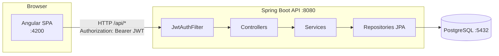

# My Sports Store

Loja virtual de artigos esportivos composta por uma API REST em Spring Boot e um frontend em Angular. O usuário faz login, navega pelo catálogo, monta o carrinho e finaliza pedidos.

```
my-sports-store/
├── my-sports-store-api/   # Backend — Spring Boot 3.5 / Java 21
├── my-sports-app-web/     # Frontend — Angular 22
└── docker-compose.yml     # PostgreSQL
```

## Funcionalidades

### Autenticação
- Cadastro de usuário (nome, e-mail e senha de 6 a 100 caracteres). Novos usuários recebem o perfil `ROLE_USER`.
- Login com e-mail e senha, que devolve um token JWT.
- Sessão mantida no navegador até o token expirar. Se a API responder 401, o frontend faz logout e volta para o login.
- Perfis `ROLE_USER` e `ROLE_ADMIN`. Um administrador é criado na primeira execução.

### Catálogo de produtos
- Listagem de produtos com filtro por categoria e busca por texto.
- 30 produtos de exemplo em 9 categorias (Futebol, Corrida, Fitness, Basquete, Tênis, Ciclismo, Natação, Vôlei, Acessórios), cadastrados automaticamente quando o banco está vazio.
- Cadastro, edição e exclusão de produtos, restritos a administradores (disponíveis apenas pela API).

### Carrinho
- Um carrinho por usuário, salvo no banco.
- Adicionar itens, alterar quantidade, remover itens e esvaziar o carrinho.
- Validação de estoque ao adicionar itens.

### Pedidos
- Finalização da compra (checkout) a partir do carrinho, com validação de estoque.
- Histórico de pedidos do usuário com itens, total, data e status (`PENDING`, `PAID`, `SHIPPED`, `DELIVERED`, `CANCELLED`).

### Telas do frontend

| Rota | Acesso | Descrição |
|---|---|---|
| `/login` | Público | Login com validação de campos e opção de mostrar a senha |
| `/register` | Público | Cadastro de nova conta |
| `/products` | Autenticado | Catálogo com filtros e botão "Adicionar" ao carrinho |
| `/cart` | Autenticado | Carrinho e finalização de compra |
| `/orders` | Autenticado | Histórico de pedidos |

## Tecnologias

### Backend (`my-sports-store-api`)
- **Java 21** e **Spring Boot 3.5**
- **Spring Web**: API REST
- **Spring Data JPA / Hibernate**: persistência
- **Spring Security** com **JWT** (biblioteca `jjwt` 0.12): autenticação stateless
- **Bean Validation**: validação das requisições
- **PostgreSQL 16**: banco de dados
- **Lombok**: redução de código repetitivo
- **JUnit 5**, **Mockito**, **Spring Security Test** e **Testcontainers**: testes
- **JaCoCo**: cobertura de código
- **Maven** (wrapper `mvnw` incluso)

### Frontend (`my-sports-app-web`)
- **Angular 22** com componentes standalone e **signals**
- **Reactive Forms**: formulários de login e cadastro
- **Angular Router** com lazy loading e guards
- **HttpClient** com interceptor funcional
- **RxJS**
- **SCSS** com tema claro/escuro automático
- **Vitest**: testes unitários

### Infraestrutura
- **Docker Compose**: PostgreSQL da aplicação

## Arquitetura



### Backend: arquitetura em camadas

```
com.example.my_sports_store_api
├── controller/   # Endpoints REST (Auth, Product, Cart, Order)
├── service/      # Regras de negócio (estoque, checkout, cálculo de totais)
├── repository/   # Interfaces Spring Data JPA
├── model/        # Entidades JPA (User, Product, Cart, CartItem, Order, OrderItem)
├── dto/          # Objetos de requisição/resposta (records)
├── security/     # SecurityConfig, JwtService, JwtAuthFilter, CurrentUserProvider
├── exception/    # GlobalExceptionHandler e ApiError (respostas de erro padronizadas)
└── config/       # DataSeeder (produtos e admin iniciais)
```

- **Controllers** recebem e validam as requisições e delegam para os services.
- **Services** concentram as regras de negócio. O usuário logado vem do `CurrentUserProvider`, então carrinho e pedidos são sempre do próprio usuário.
- **Segurança stateless:** o `JwtAuthFilter` valida o token em cada requisição. As rotas `/api/auth/**` e `GET /api/products/**` são públicas. Escrita em produtos exige `ROLE_ADMIN`. As demais rotas exigem autenticação.
- **Erros** seguem o formato único `ApiError` (`timestamp`, `status`, `message`, `fieldErrors`).

### Frontend: organização

```
src/app
├── core/          # Serviços e infraestrutura compartilhada
│   ├── auth.service.ts       # Login/cadastro/logout, sessão em signal + localStorage
│   ├── auth.interceptor.ts   # Adiciona o token JWT e trata 401
│   ├── auth.guard.ts         # authGuard (rotas privadas) e guestGuard (login/cadastro)
│   ├── store.service.ts      # ProductService, CartService, OrderService
│   ├── error-message.ts      # Converte ApiError em mensagem amigável
│   └── models.ts             # Tipos espelhando os DTOs da API
├── layout/shell.*  # Barra superior + <router-outlet> das páginas autenticadas
└── pages/          # login, register, products, cart, orders (carregadas sob demanda)
```

- O estado da sessão e do carrinho fica em **signals** dentro dos services, e os componentes leem esses valores direto.
- Em desenvolvimento, o `proxy.conf.json` encaminha `/api` para `http://localhost:8080`, então não há problema de CORS.

### Endpoints da API

| Método | Rota | Acesso | Descrição |
|---|---|---|---|
| POST | `/api/auth/register` | Público | Cria conta e retorna token |
| POST | `/api/auth/login` | Público | Autentica e retorna token |
| GET | `/api/products?category=&search=` | Público | Lista produtos |
| GET | `/api/products/categories` | Público | Lista categorias |
| GET | `/api/products/{id}` | Público | Detalhe do produto |
| POST / PUT / DELETE | `/api/products[/{id}]` | Admin | Cria, altera ou remove produto |
| GET | `/api/cart` | Autenticado | Carrinho atual |
| POST | `/api/cart/items` | Autenticado | Adiciona item ou define a quantidade (`{productId, quantity}`) |
| DELETE | `/api/cart/items/{productId}` | Autenticado | Remove item |
| DELETE | `/api/cart` | Autenticado | Esvazia o carrinho |
| POST | `/api/orders/checkout` | Autenticado | Gera pedido a partir do carrinho |
| GET | `/api/orders` | Autenticado | Lista pedidos do usuário |
| GET | `/api/orders/{id}` | Autenticado | Detalhe de um pedido |

## Como executar

### Pré-requisitos
- Java 21
- Node.js 22+ e npm
- Docker e Docker Compose

### 1. Banco de dados

```bash
cp .env.example .env   # preencha POSTGRES_PASSWORD
docker compose up -d postgres
```

Isso sobe o PostgreSQL em `127.0.0.1:5432` com banco e usuário `sportsstore`. A senha não tem valor padrão: o `docker compose` recusa subir enquanto `POSTGRES_PASSWORD` não estiver definida no `.env`. Banco, usuário e porta podem ser alterados por `POSTGRES_DB`, `POSTGRES_USER` e `POSTGRES_PORT`.

### 2. Backend

A API precisa das variáveis de ambiente abaixo. Elas podem ser exportadas no shell ou definidas no `.env` da raiz do projeto, que a API carrega automaticamente (`spring.config.import`):

| Variável | Obrigatória | Exemplo | Descrição |
|---|---|---|---|
| `JWT_SECRET` | Sim | `uma-chave-secreta-com-pelo-menos-32-bytes` | Chave HMAC do JWT (mínimo de 32 caracteres) |
| `JWT_EXPIRATION` | Sim | `86400000` | Validade do token em ms (24h) |
| `CORS_URI` | Sim | `http://localhost:4200` | Origens permitidas, separadas por vírgula |
| `DB_URL` | Não | `jdbc:postgresql://localhost:5432/sportsstore` | URL do banco |
| `DB_PASSWORD` | Sim | — | Senha do banco (a mesma de `POSTGRES_PASSWORD`) |
| `DB_USERNAME` | Não | `sportsstore` | Usuário do banco |
| `ADMIN_EMAIL` / `ADMIN_PASSWORD` | Não | — | Se ambas forem definidas, cria esse administrador na inicialização |

```bash
cd my-sports-store-api
export JWT_SECRET=$(openssl rand -base64 48)
export JWT_EXPIRATION=86400000
export CORS_URI=http://localhost:4200
export DB_PASSWORD=<mesma senha de POSTGRES_PASSWORD>
export ADMIN_EMAIL=<e-mail do admin>
export ADMIN_PASSWORD=<senha forte do admin>
./mvnw spring-boot:run
```

A API fica disponível em `http://localhost:8080`. Na primeira execução são criados os produtos de exemplo e, se `ADMIN_EMAIL` e `ADMIN_PASSWORD` estiverem definidas, o usuário administrador. Sem elas, nenhum administrador é criado.

### 3. Frontend

```bash
cd my-sports-app-web
npm install
npm start
```

Acesse `http://localhost:4200` e faça login com o administrador configurado ou crie uma conta em **Cadastre-se**.

Build de produção: `npm run build` (saída em `dist/my-sports-app-web`).

## Testes e qualidade

```bash
# Backend: testes unitários e de integração + relatório de cobertura (target/site/jacoco)
cd my-sports-store-api
./mvnw verify

# Frontend: testes unitários (Vitest)
cd my-sports-app-web
npm test -- --watch=false
```

> O teste de contexto do backend (`MySportsStoreApiApplicationTests`) usa Testcontainers, então o Docker precisa estar rodando.
